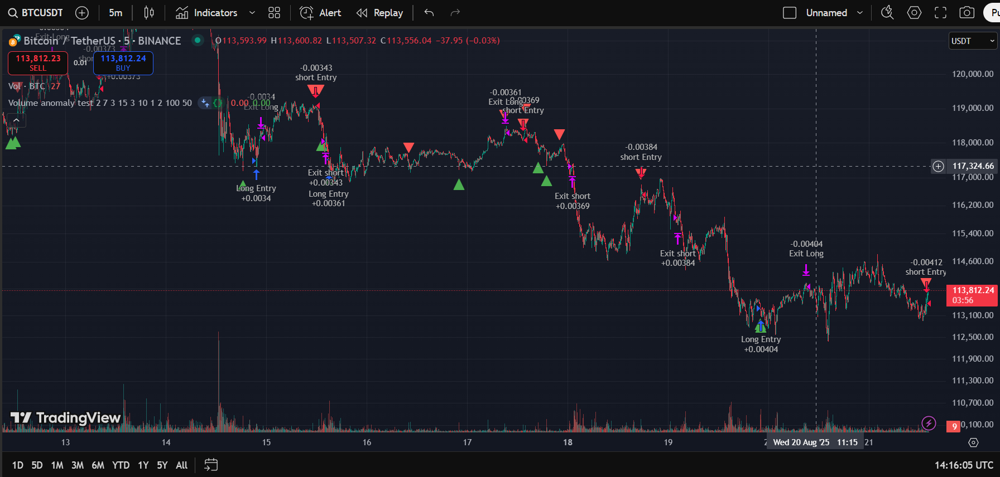

# Volume Anomaly (TradingView Pine Script)

This folder contains the **Volume Anomaly Indicator** and two trading strategies implemented in **Pine Script v5** for use on [TradingView](https://www.tradingview.com/).

The goal is to detect **unusual trading volume events** compared to historical averages, and use these anomalies to build trading strategies.

---

## Files

- **indicator.txt**  
  Pine Script code for the **Volume Anomaly Indicator**.

- **VA_Strategy_1.txt**  
  First trading strategy built on the Volume Anomaly Indicator. Includes profit/loss targets and leverage handling.

- **VA_Strategy_2.txt**  
  Alternative strategy version with different exit rules and dynamic trade management.

- **images/**  
  Contains example screenshots.
  
---

## ⚠️ Disclaimer

This project is for **educational and research purposes only**.  
Trading involves substantial risk, and past performance does not guarantee future results.  
Use these scripts responsibly and always test before live trading.

---

## Indicator Overview

The **Volume Anomaly Indicator** detects abnormal spikes in trading volume relative to recent average candle bodies.  
Such anomalies may signal potential **trend reversals** or **breakouts** and are highlighted directly on the chart:

- 🟢 **Green Triangle (below bar):** Long anomaly  
  Triggered when unusually high **bearish volume** occurs together with either:  
  - a **small candle body**, or  
  - a **large upper shadow (wick)**  
  This pattern can indicate exhaustion of selling pressure and a possible upward move.  

- 🔴 **Red Triangle (above bar):** Short anomaly  
  Triggered when unusually high **bullish volume** occurs together with either:  
  - a **small candle body**, or  
  - a **large lower shadow (wick)**  
  This pattern can suggest buying exhaustion and a potential downward move.  

---

## Strategies

### 1️⃣ Volume Anomaly Strategy 1
- Uses the indicator signals as trade entries.  
- Applies **take-profit** and **stop-loss** based on percentages.  
- Includes leverage and equity-based position sizing.  
- Avoids trades near recent highs/lows to reduce false signals.

### 2️⃣ Volume Anomaly Strategy 2
- Similar entry logic to Strategy 1.  
- Exit rules are adjusted to be **more dynamic**, closing trades earlier when certain price conditions are met.  
- Useful for testing different market conditions and exit strategies.

---

## Inputs Explanation

Each script comes with adjustable parameters that allow users to fine-tune the behavior of the indicator or strategies.

### Common Inputs (Indicator & Strategies)
- **Volume SMA length (`length`)**  
  Number of candles used to calculate the moving average of volume.  
  A higher value smooths out noise, while a lower value makes the anomaly detection more sensitive.  
  *Default: 7*

- **Volume limit (ratio) (`n`)**  
  Multiplier that defines how much larger the current volume must be compared to the average to be considered an anomaly.  
  *Default: 3*

---

### Strategy-Specific Inputs

#### Trade Filters
- **High/Low Period (`maxrange`)**  
  Lookback period (in candles) used to find recent highest highs and lowest lows.  
  Helps avoid taking trades too close to extremes.  
  *Default: 15*

- **Max distance from hihi/lolo (`minrange`)**  
  Number of candles after which a new high/low is no longer considered active.  
  *Default: 3*

#### Trade Management
- **Leverage (`leverage`)**  
  Leverage factor applied to the simulated trades.  
  *Default: 10*

- **Profit percent (`profitperc`)**  
  Take-profit target as a percentage of entry price.  
  *Default: 1%*

- **Loss percent (`lossperc`)**  
  Stop-loss threshold as a percentage of entry price.  
  *Default: 0.5% (Strategy 1)*  
  *Default: 2% (Strategy 2)*

- **Trade equity (`trade_equity`)**  
  Base amount of capital allocated per trade before applying leverage.  
  *Default: 100*

- **Percent of equity in each trade (`percent_of_trade_equity`)**  
  Percentage of the defined equity to commit per trade.  
  *Default: 50%*

---

### Strategy 2 Special Rules
In addition to the above, **Strategy 2** introduces dynamic exit conditions:  
- **Exit on breakout confirmation:**  
  If price closes beyond the previous bar’s high/low, existing positions may be exited early.  
- This makes Strategy 2 more reactive, often capturing smaller moves but avoiding prolonged drawdowns.

---

## Usage

1. Open [TradingView](https://www.tradingview.com/).
2. Go to **Pine Editor**.
3. Copy the contents of any `.txt` file from this repo.  
   - `indicator.txt` → create a new **Indicator**.  
   - `VA_Strategy_1.txt` / `VA_Strategy_2.txt` → create a new **Strategy**.
4. Click **Save** and then **Add to Chart**.
5. Adjust input parameters (volume SMA length, ratio, profit %, loss %, leverage, etc.) to fit your style.

---

## Examples

Indicator visualization:  

Strategy 1 examples: 

  

Strategy 2 examples:  

  

