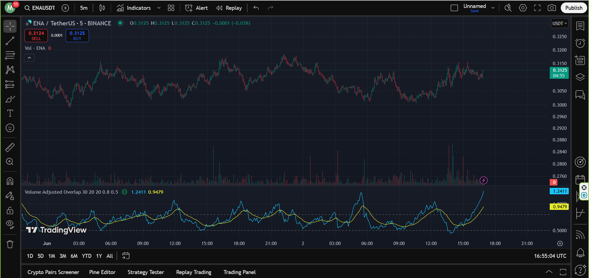

# Volume Adjusted Overlap (VAO)

This TradingView Pine Script indicator is called **Volume Adjusted Overlap**. It calculates a custom **"correction index"** based on overlapping price ranges between candles and adjusts it using volume to better reflect market behavior.

## Concept

The indicator aims to quantify price overlap between consecutive bars and scale it with a volume-based adjustment. This approach can help detect potential periods of **price congestion or corrections**, providing visual cues via the correction index and its moving average.

## Plotted Outputs

- `correction index` (Blue Line): Measures adjusted overlap strength scaled by volume.
- `correction index ema` (Yellow Line): EMA of the correction index to smooth out short-term fluctuations.
- `Upper limit line` (Default: 0.8): A horizontal reference line for high correction index values.
- `Lower limit line` (Default: 0.5): A horizontal reference line for low correction index values.

## Inputs

| Input Name                   | Description                                           | Default |
|-----------------------------|-------------------------------------------------------|---------|
| `Volume Ma Length`          | Length for EMA calculation of volume                 | 30      |
| `Overlap sma length`        | Length for SMA of the overlap value                  | 20      |
| `Average Overlap ema length`| EMA length to smooth the correction index            | 20      |
| `correction index up limit` | Horizontal line marking upper threshold of index     | 0.8     |
| `correction index down limit`| Horizontal line marking lower threshold of index   | 0.5     |

## How It Works

1. **Overlap Amount**: Measures the overlapping part of the high-low ranges between the current and previous bar.
2. **Normalized Overlap**: The overlap is normalized by the full bar range.
3. **Smoothing**: The normalized overlap is smoothed using a Simple Moving Average (SMA).
4. **Volume Adjustment**: The smoothed overlap is scaled by the maximum of an EMA of volume, to emphasize more meaningful price movements.
5. **Final Index**: This volume-adjusted overlap is called the "correction index" and is plotted along with its EMA.

## Use Case

Traders may use this indicator to:

- Detect zones of **price compression or correction**.
- Identify possible reversal zones when the index exceeds defined thresholds.
- Complement other price/volume analysis tools in range-bound or consolidating markets.

## Example Usage

You can add this script to TradingView by creating a new indicator and pasting the script into the Pine Editor.
Below is an example of how the Volume Adjusted Overlap indicator looks on a TradingView chart:

---

Feel free to adjust the threshold levels and smoothing lengths depending on your trading style and asset type.

